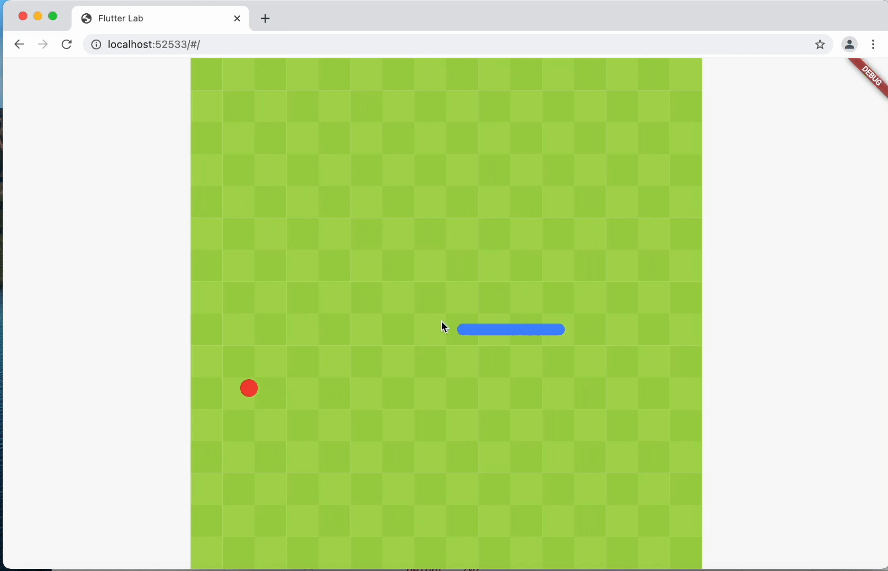

# flutter_snake
A simple snake game built with flutter.

Use <kbd>↑</kbd><kbd>↓</kbd><kbd>←</kbd><kbd>→</kbd> to control.

[Online Demo](https://lpylpyleo.github.io/flutter_snake/)

## TODO
- use virtual stick to control for mobile devices
- self collision detection